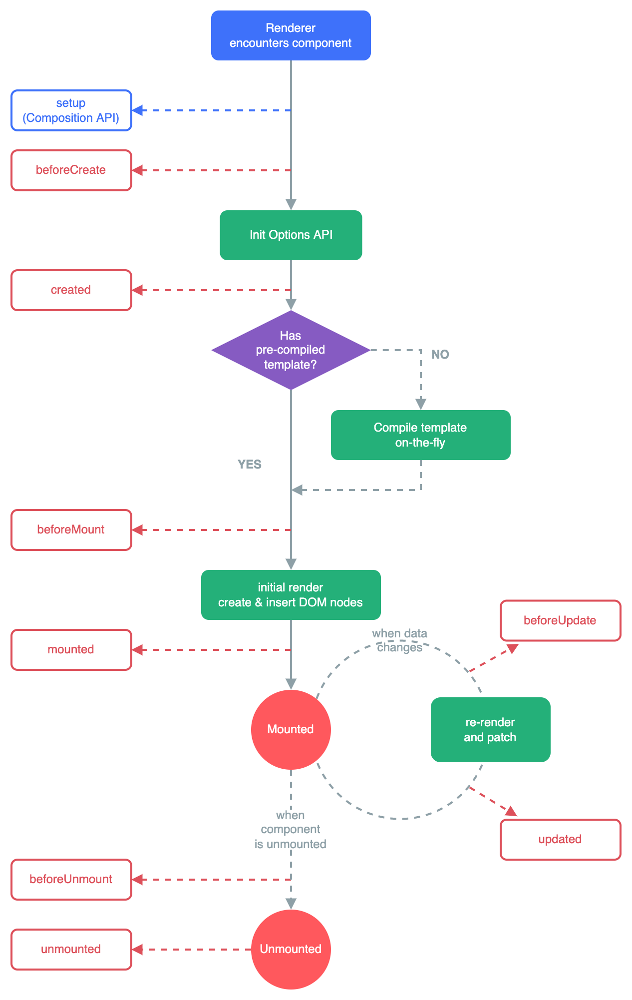

# Learn Vue
Following Vue tutorials


## Notes

- Live server extension: right click in html file
- See Javascript logs in developer console (command+option+J to open on chrome)

## Vue
### Create new vue project
$ vue create <project_name>

Starter files

- node_modules
    - stores libraries/dependencies for project
- public
    - stores boilerplate index.html
- src
    - source code lives here: components, templates, css
    - main.js
    - App.vue
        - stores vue components
- package.json
    - contains info on dependencies, scripts to serve + build app
    - $ yarn serve
    - $ yarn build

### Package Manager
[npm vs yarn](https://classic.yarnpkg.com/en/docs/migrating-from-npm#toc-cli-commands-comparison)

### Project Structure

- .vue
    - each .vue file defines a single vue component
    - shortcut to templated .vue file: type `vue` in vscode
    - each vue component contains 3 parts
        - html `template`
        - `script`
            - can import elements from components folder
                - ```import HelloWorld from './components/HelloWorld.vue'```
            - stores root component object containing data, methods, computed properties, etc.
        - `style`
            - `scoped` keyword allows styling to only apply to html elements within the same module/script.
            - ```html
                <style scoped>
                    .h1 {}
                </style>

starts off as blank html, then vue components are injected as necessary

### Programming Elements

#### Variables (data)

- defined in `js` within `data()` in root component object
- to reference in `html`, use `{{ variable_name }}`
- Example
    - ```javascript
        data() {
        // can define as many properties in object as you want
            return {
                name: "Ryan Wong",
                job: "Data Analyst",
                age: 23
            }
        }

#### Directives
Attaches logic/behavior to different html elements
Expects: `<directive>:<event>="<Function(optional argument(s))/ variable/ statment>"`

- example: `<li v-for="team in teams" :class="{ fav: team.isFav }" @click="toggleFavTeam(team)">`

**List of Directives** 

- v-on
    - Allows us to react to events
    - Shorthand: `@`
    - Example: `<button v-on:click="age++">Increase Age</button>`
- v-if
    - Implement if/else if/else logic
    - See also: `v-else-if`, `v-else`
    - Example: 
        - ```html
            <button @click="toggleShowText">
                <span v-if="showText">Hide Text</span>
                <span v-else-if="!showText">Show Text</span>
                <span v-else>Not possible</span>
            </button>
            ```
- v-bind
    - Binds dynamic attribtes (variables) to component
    - Shorthand: `:`
    - Example: `<a v-bind:href="url">linky</a><br>`, where url is variable containing a url
- v-for
    - Implement for loop
    - Example: 
        - ```html
            <li v-for="team in filteredTeams" :class="{ fav: team.isFav }">
                <h3>{{ team.name }}</h3>
                <p>{{ team.color }}</p>
                <a :href="team.url">link</a>
            </li>
            ```
        - Conditionally adding class
            - pass object with key value pair `{classname: condition}`
            - if condition is true, class will be added to component
- v-model
    - Create a two-way binding on a form input element or a component.
    - Specifies what property you want to track input in
    - Example: `<input type="password" required v-model="password">`
        - tracks input in data variable `password`
    - Two way binding: 
        - If user updates entry in form, variable is updated
        - If variable is updated, modifies what we see in input field (and any other place where we output the variable)
#### Mouse Events
Example:
```html
<div class="box" @mouseleave="handleEvent($event, 'word')">Mouseleave</div>
```
- mouseover
    - Triggers if mouse hovers over component
- mouseleave
    - Triggers if mouse leaves component
- dblclick
    - Triggers if component is double clicked
- mousemove
    - Tracks the position of the mouse; (x,y) coordinates from top left corner

#### Methods

- defined in `js` within `methods` in root component object
- `FunctionName(arg1, arg2, ...)`
- To access global variables (defined in data): `this.variable_name`
- Handling events
    - Function used to define behavior after event occurs
    - Event object is automatically passed as first argument (even if no arguments are passed manually)
        - `index.html`:
            - `<div class="box" @mousemove="handleMousemove">Position: {{x}},{{y}}</div>`
        - `app.js`
            - ```javascript
                handleMousemove(e){
                    this.x = e.offsetX
                    this.y = e.offsetY
                }
                ```
    - If you want to pass arguments, use `$event` keyword
        - `index.html`:
            - `<div class="box" @mouseleave="handleEvent($event, 'word')">Mouseleave</div>`
        - `app.js`
            - ```javascript
                handleEvent(event, data){
                    console.log(event)
                    console.log(event.type)
                    if(data){
                        console.log(data)
                    }
                }
- Printing/Debugging
    - `console.log()`

#### Computed Properties

- Property that depends on other data
- defined in `js` within `computed` in root component object
- Example
    - `data()`:
        - ```javascript
            teams: [
                {name: "Man Utd", color: "Red", url: "https://www.manutd.com/", isFav:true},
                {name: "Man City", color: "Blue", url:"https://www.mancity.com/", isFav:false},
                {name: "Newcastle", color: "Black", url:"https://www.nufc.co.uk/", isFav:false}
            ]
    - `computed`:
        - ```javascript
            filteredTeams(){
                // filter is javascript built in method
                return this.teams.filter((team) => team.isFav) // filters out non fav teams
            }
            ```

#### Template Refs
- Used to provide direct access to underlying DOM (html) elements after they are mounted
```html
    <input ref="input">
```
- Gives access to `<input>` element
- Access in methods using `this.$refs.<ref_name>`
    - ref_name is `input` in this example
- Can then apply [html DOM element functions](https://www.w3schools.com/jsref/dom_obj_all.asp)
    - [devdocs documentation](https://devdocs.io/dom/htmlelement)
    - Eg. `this.$refs.input.focus()`

#### Components
- imported and declared in `<script>` section
```javascript
<script>
import HelloWorld from './components/HelloWorld.vue'
export default {
    components: { HelloWorld }
}
</script>
```
- can be used in html `<template>` section
```html
<template>
    <HelloWorld />
</template>
```

#### Props
- Enables passing data to child components using custom attributes
- A component can have unlimited # of prop
- By default, any value can be passed to any prop

**Registering Props**
- declared in `<script>` section with keyword `props`
- Array of strings or dict
```javascript
<script>
    export default {
        props: ['title', 'likes', 'isPublished', 'commentIds', 'author']
    }
</script>
```
or
```javascript
<script>
    export default {
        props: {
            title: String,
            likes: Number,
            isPublished: Boolean,
            commentIds: Array,
            author: Object,
            callback: Function,
            contactsPromise: Promise // or any other constructor
        }
    }
</script>
```

**Passing Data**

*Static*
```html
<blog-post title="My journey with Vue"></blog-post>
```
- Passing prop `title` with value "My journey with Vue" to blog-post component
- prop must be declared

*Dynamic*
```html
<template>
    <blog-post 
        v-for="post in posts" 
        v-bind:cover="post.title + ' by ' + post.author"
        v-bind:id="post.id"
    ></blog-post>
</template>
<script>
import blog-post from './components/blog-post.vue'
export default {
    components: { blog-post },
    props: { cover: String, id: Number },
    data() {
        posts: [
            {'id':1, 'author': 'RW', 'title': 'my first post'},
            {'id':2, 'author': 'WR', 'title': 'my second post'}
        ]
    }
}
</script>
```
- need to v-bind (or just `:` for short) to pass values other than strings (eg. post id in example above)

#### Custom Events
- While props are for passing data from parent to child, custom events are used for passing data from child to parent
- Define event keyword using `this.$emit('keyword')`
- Accept argument in parent class
- Example: Modal class (child) inside App class (parent)

In `Modal.vue`
```javascript
<template>
    <div class="backdrop" @click="closeModal">
        <div class="modal"></div>
    </div>
</template>

<script>
export default {
    methods: {
        closeModal() {
            this.$emit('close')
        }
    }
}
</script>
```
- when backdrop is clicked, method closeModal() is called and a custom event 'close' is emitted

In `App.vue`
```javascript
<template>
    <Modal @close="toggleModal"></Modal>
</template>

<script>
import Modal from './components/Modal.vue'
export default {
  components: { Modal },
  data() {
    return {
      showModal: false
    }
  },
  methods: {
    toggleModal() {
      this.showModal = !this.showModal
    }
  }
}
</script>
```
- Modal element takes a 'close' parameter which runs toggleModal() function when the custom event is emitted

**Adding arguments to emit**
Child - `$emit('add', Math.random(), 44, 50)`
Parent - `@add="custom_function(i, j, k)"`
- passes 3 arguments into custom_function in parent which takes 3 arguments i, j, k.

#### Click Event Modifiers
- Attach modifier to click event: .<event_name> after click
- Example: `<button @click.right="toggleModal">Show Modal</button>`
    - modifies so only triggers on right click
- Example: `<div class="backdrop" @click.self="closeModal">`
    - only applies if you click on the class, not elements inside/outside
- [documentation](https://devdocs.io/vue~3/guide/essentials/event-handling#event-modifiers)


#### Slots
- Used to pass templates into components
- Pass more complex data than props
- Pass template between the component tags, then within the component file define where you want the template to go using `<slot></slot>`

Example
In `App.vue`
```javascript
<Modal
    @close="toggleModal"
>
    <h1>Header Here</h1>
    <p>Para, para, paragraph</p>
</Modal>
```
- the h1, p makes up the template
- If you use another Modal template somewhere else, you can pass in a different template and it will be rendered where the slot tag is

In `Modal.vue`
```javascript
<div class="modal">
    <h2>Some info here</h2>
    <h3>blah blah</h3>
    <slot></slot>
</div>
```
- Causes the h1 and p template to appear under the h3 in the modal component

**Named Slot**
- If you want some elements from the passed in template at a different location from the rest of the template
- `<template v-slot:name>`

In `App.vue`
```javascript
<Modal
    @close="toggleModal"
>
    <template v-slot:link>
        <a href="www.google.com">google link</a>
    </template>
    <h1>Header Here</h1>
    <p>Para, para, paragraph</p>
</Modal>
```
- default template outside named template always gets populated at `<slot>`
- named template (`link` in this case) gets populated

In `Modal.vue`
```javascript
<div class="modal">
    <h2>Some info here</h2>
    <h3>blah blah</h3>
    <slot></slot>
    <div class="namedSlot">
        <slot name="link"></slot>
    </div>
</div>
```
- Causes the h1 and p template to appear under the h3 in the modal component

**Default Content**
- If you put content between the `<slot></slot>` tags, it becomes default content that only populates if you don't pass anything through the default slot of the component (eg. `<Modal></Modal>`)
    - eg. `<slot>Default Content</slot>`
- Applies even if a named slot is passed as long as nothing is passed through the default slot.
    - eg. you would still see default content here since there is no default slot:
```javascript
<Modal
    @close="toggleModal"
>
    <template v-slot:link>
        <a href="www.google.com">google link</a>
    </template>
</Modal>
```

#### Teleport
- Lets us send template code to places in the DOM outside our view app
- Enables independent rendering of components so it does not have to depend on styling from parent 
Example
```javascript
<teleport to="#target">
    <!--template you want to send goes here-->
</teleport>
```
- sends template to a div with class target outside of `<div id="app"></div>` in `index.html`
- also works with ids: `to=".target"` sends it to a div with id=target
- can also just send to `body` with `to="body"`

#### Lifecycle Hooks

Red boxes: the different lifecycle hooks/functions we can use to fire code at different points during the component's lifecycle

- beforeCreate
    - fires before component is created
    - cannot access any data from the data object or any template elements
- created
    - component is created, but not yet mounted to the DOM
    - can access data
    - cannot access template
- beforeMount
    - just before component is mounted to DOM
    - can access data, events, and templates
- mounted
    - popular spot to match fetch requests if you need data for your component
- beforeUpdate
    - if data changes, happens after data changes but before updates are re-rendered to DOM
- updated
    - after all data changes have been updated in the browser
- beforeUnmount
    - use for cleanup
- unmounted
    - use for cleanup

**Implementation**
- Goes inside the component `.vue` file
```javascript
<script>
export default {
    props: ['delay'],
    mounted(){
        console.log('component mounted')
    }
}
</script>
```
- eg. uses mounted lifecycle hook, code runs when mounted
#### Vue Router
- User makes one request to server (through specifying URL)
    - eg. www.mywebsite.com, or www.mywebsite.com/about, etc.
- Depending on the URL, vue decides what component to nest in the browser
- After initial link, when we navigate the website, we don't send additional requests to server; Vue intercepts requests and adjusts components based on route
    - intercept requests using `<router-link>` tag

**Initialize Project with Vue Router**
New default folder: `src > router`
- `src/router/index.js`: where we set up our routes using `routes` array
- Each route object has 3 properties
    - path: url path (on top of base path, eg. `/about`)
    - name: page identifier (eg. `About`)
    - component: component used when routed to
        - need to import component at top of `index.js`
        - eg. `import About from '../views/About.vue'`
- Create router instance
```javascript
const router = createRouter({
  history: createWebHistory(process.env.BASE_URL),
  routes
})
```
- in `main.js`
    - Use router: `createApp(App).use(router).mount('#app')`
- `src/views`
    - where our components live (.vue files)
- `components`
    - Used to store reusable components (eg. modal, custom buttom, card components etc.)
    - Anything that doesn't belong to just one page
- `App.vue`
    - `<router-view/>` tag
        - location of where components from `routes` array will be dynamically injected (depending on the route we visit)

**Router Links**
- `<router-link>` tag intercepts requests to server and is used to determine which Vue components to inject (based on routes array)
- Example: `<router-link to="/about">About</router-link>`
- Example (using `name` property): `<router-link :to="{ name: 'About' }">About</router-link>`

**Route Parameters**
- Variable parts of a URL segment used to create dynamic routes based on user input
    - eg. on a `Users` page where you can select a user by id, the user ID becomes the route parameter and is used to link to a profile page for that specific user
- Add to routes array with path `:<route parameter>` (typically `id`)
    - specify that a keyword is a route parameter with `:`
```javascript
{
    path: '/jobs/:id',
    name: 'jobs',
    component: Jobs
}
```

**Route Object**
- `$route` contains information about the current route
    - route parameter value
        - eg. `<p>The Job ID is {{ $route.params.id }}</p>`, where route parameter variable name is `id`
- store variable within `data` object
```javascript
<script>
export default {
    data() {
        return {
            id: this.$route.params.id
        }
    }
}
</script>
```

**Passing Value to Child Class**
```javascript
<template>
    <h1>Jobs</h1>
    <div v-for="job in jobs" :key="job.id">
        <router-link :to="{ name: 'JobDetails', params: { id: job.id } }">
            <h2>{{ job.title }}</h2>
        </router-link>
    </div>
</template>
```
- to: link to the `JobDetails` element in `routes` array (that has path `/Jobs/:id`)
- params consists of key value pairs, key is variable you name that you pass into child class

**Accepting Data from Parent Class**
- In `routes` array, add new property to Child Class: `props: true`
```javascript
{
    path: '/jobs/:id',
    name: 'JobDetails',
    component: JobDetails,
    props: true
}
```
- In child class, accept prop (name is variable name passed in through `params` object)
```javascript
<script>
export default {
    props: ['id']
}
</script>
```

**Redirecting Paths**
- eg. Want `/all-jobs` to redirect to `jobs`
- Add redirect element to `routes` array
```javascript
{
    path: '/all-jobs',
    redirect: '/jobs'
}
```

**404 Catch All Page**
- In `routes` array:
```javascript
{
    path: '/:catchAll(.*)',
    name: 'NotFound',
    component: NotFound
}
```
- Define `NotFound.vue` in `src/views`
```javascript
<template>
    <h2>404</h2>
    <h3>Page Not Found</h3>
</template>
```

**Programmatic Navigation**
- With `$router` object, we have access to web history (eg. what pages the user has been on)
- Can direct users to different pages based on web history
- Go back one page
```javascript
<template>
    <button @click="back">Go Back</button>
</template>

<script>
export default {
    methods: {
        back() {
            this.$router.go(-1)
        }
    }
}
</script>
```
- Go to specific page
    - push page onto web history
```javascript
<template>
    <button @click="redirectHome">Go Home</button>
</template>

<script>
export default {
    methods: {
        redirectHome() {
            this.$router.push({ name: 'Home' })
        }
    }
}
```